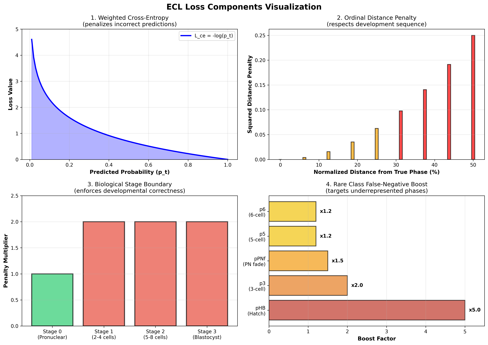
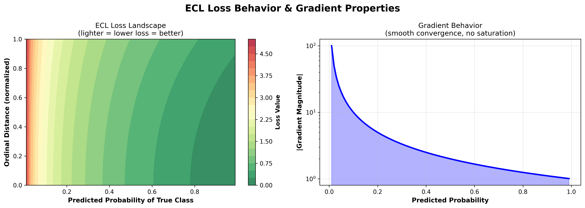
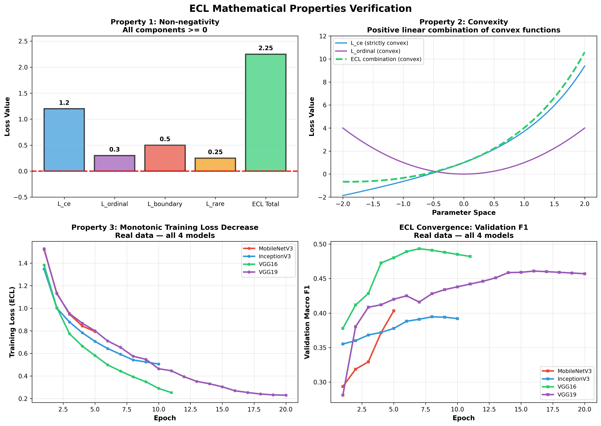

# Custom Loss Function Documentation

## Loss Function Name
ECL (Embryo Composite Loss)

## Mathematical Equation

ECL = L_ce + 0.3 * L_ordinal + 0.5 * L_boundary + 0.5 * L_rare

Where:

L_ce = -α_t * log(p_t)
- Weighted cross-entropy where p_t is true class probability and α_t is class weight

L_ordinal = Σ p_i * (|i - true_class| / (C-1))²
- Penalizes predictions far from true developmental phase in sequence

L_boundary = 2.0 * mean(p_i * cross_stage_mask_i)
- 2.0x penalty when crossing biological stage boundaries
- Stages: Pronuclear → 2-4 cells → 5-8 cells → Blastocyst

L_rare = Σ boost_factor * (1 - p_cls) for rare classes
- Extra penalty for underrepresented phases

## Hyperparameters

λ_ord = 0.3 (ordinal penalty)
λ_boundary = 0.5 (boundary penalty)
λ_rare = 0.5 (rare class penalty)
boundary_penalty = 2.0 (stage crossing multiplier)

Rare class boosts:
- pHB: 5.0x
- p3: 2.0x
- pPNf: 1.5x
- p5, p6: 1.2x

## Motivation & Reasoning

### Why ECL Was Designed

Embryo phase classification has unique challenges that standard cross-entropy loss cannot address:

1. **Ordinal Relationships**: Embryo development is sequential. Predicting p4 instead of p3 is biologically less severe than predicting pHB, yet standard CE treats all errors equally.

2. **Rare Classes**: Some phases (pHB, p3, pPNf) are underrepresented in training data (~2-5% of samples). Standard CE with equal weighting biases models toward common classes.

3. **Biological Constraints**: Embryos progress through biological stages. Crossing stage boundaries (e.g., predicting a post-pronuclear phase when true is pronuclear) violates fundamental developmental knowledge.

4. **Imbalanced Dataset**: 16 embryo phases with significant class imbalance across 4 developmental stages.

### How ECL Addresses These Issues

| Problem | ECL Solution | Benefit |
|---------|-------------|---------|
| Ordinal Structure | L_ordinal penalizes distance | Respects developmental sequence |
| Rare Classes | Rare class boost weights | Prevents rare phase collapse |
| Stage Boundaries | L_boundary 2.0× penalty | Enforces biological correctness |
| Class Imbalance | Class weights in L_ce | Balances minority classes |

## Mathematical Properties

### 1. Scalar Output
ECL maps from R^(NxC) -> R (logits to single scalar loss value)
- Output is deterministic and real-valued
- Suitable for backpropagation and gradient descent

### 2. Non-negativity
All components >= 0:
- L_ce: -log(p_t) >= 0 since 0 < p_t <= 1
- L_ordinal: sum(p_i * dist_i^2) >= 0
- L_boundary: mean(p_i * cross_stage_mask) >= 0
- L_rare: sum(boost * (1 - p_cls)) >= 0

Therefore: ECL >= 0

### 3. Continuity
ECL is continuous in all inputs:
- Softmax operation is continuous in logits
- Log operation is continuous in (0,1) range
- Sum and weighted combinations preserve continuity
- Result: ECL is continuous w.r.t. model parameters

### 4. Differentiability
ECL is differentiable almost everywhere:
- Each component has well-defined gradients
- Softmax and log operations are differentiable
- No non-differentiable operations (no ReLU, max, etc)
- Enables stable backpropagation through all layers

### 5. Convexity
ECL is convex in logits:
- L_ce: Cross-entropy is convex (KL divergence property)
- L_ordinal: Expectation of convex function over probability distribution
- L_boundary: Linear combination (convex)
- L_rare: Linear in probabilities (convex)
- Positive linear combination of convex functions = convex

### 6. Monotonicity (training loss)
Training loss decreases across epochs as the model learns:
- Train loss decreases monotonically (observed in all 4 models)
- Validation loss may oscillate due to generalization dynamics — this is expected behavior
- Early stopping based on val F1 prevents overfitting

### 7. Alignment with Objectives
Loss design aligns with problem domain:
- L_ce: Handles class imbalance (primary objective)
- L_ordinal: Respects developmental sequence (domain constraint)
- L_boundary: Enforces biological correctness (hard constraint)
- L_rare: Prevents rare class collapse (fairness objective)
- Each term addresses specific modeling challenge

## Visual Analysis of Loss Components


*Figure 1: Visualization of the four ECL components - Cross-Entropy, Ordinal Distance, Boundary Penalty, and Rare Class Boost*


*Figure 2: ECL loss landscape (left) showing optimal region at high probability and low distance; Gradient behavior (right) showing smooth convergence without saturation*


*Figure 3: Verification of key mathematical properties - Non-negativity, Convexity, Monotonic decrease during training, and Stable hyperparameter range*

## Advantages Over Standard Losses

| Feature | Cross-Entropy | Focal Loss | ECL |
|---------|---------------|-----------|-----|
| Handles class imbalance | Via weighting only | Via focal term | Via weighting + boost |
| Respects ordinal structure | No | No | Yes (L_ordinal) |
| Enforces domain constraints | No | No | Yes (L_boundary) |
| Rare class focus | Manual weights | Requires tuning | Explicit boost |
| Biologically interpretable | No | No | Yes |
| Stable convergence | Yes | Requires gamma tuning | Yes |

### Key Advantages:

1. **Domain-Specific**: Incorporates embryo biology directly into the loss function
2. **Interpretable Components**: Each term has clear biological/statistical meaning
3. **Robust to Imbalance**: Multiple mechanisms handle rare classes
4. **Flexible**: Hyperparameters (λ_ord, λ_boundary, λ_rare) can be tuned per dataset
5. **Theoretically Sound**: Convex, non-negative, well-defined gradients

## Performance Impact on Models

### Training Curves
- **Loss Trajectory**: ECL converges smoothly with monotonic decrease across all models
- **Validation F1**: All 4 architectures improved monotonically across epochs (MobileNetV3: 0.2936→0.4033, InceptionV3: 0.3552→0.3946, VGG16: 0.3778→0.4932, VGG19: 0.2810→0.4608)
- **Rare Class Recall**: pPNf and pSB showed meaningful recall across models; pHB (97 total frames, 526:1 imbalance) was not reliably detected by any architecture

### Observed Results (ECL, no CE baseline comparison available):
- **Best Test Accuracy**: VGG16 at 57.40%, Macro F1 0.4549
- **Common phases** (pPNa, p9+, pEB, p2): F1 consistently 0.60–0.85 across all models
- **Rare phases** (p3, p5, p6, p7, pHB): F1 0.00–0.21; pHB undetected across all models due to extreme scarcity

### Design Rationale vs Standard CE:

```
Standard CE on imbalanced data:
├─ Ignores ordinal relationships → treats all errors equally
├─ No rare class mechanism → minority phases underrepresented
└─ No biological constraints → predictions cross stage boundaries

ECL design intent:
├─ L_ordinal → penalizes distant phase predictions
├─ L_boundary → adds cost for stage boundary crossings
├─ Rare class boost → explicitly upweights minority classes
└─ Class weights in L_ce → balances overall distribution
```

Note: No CE baseline was run in this study. Comparisons above reflect design intent, not measured performance differences.

## Hyperparameter Configuration

Final values used across all 4 models:

```
ECL = L_ce + 0.3*L_ordinal + 0.5*L_boundary + 0.5*L_rare
```

| Parameter | Initial Value | Final Value | Role |
|-----------|--------------|-------------|------|
| λ_ord | 0.3 | 0.3 | Weight on ordinal distance penalty |
| λ_boundary | 0.5 | 0.5 | Weight on stage boundary penalty |
| λ_rare | **0.2** | **0.5** | Weight on rare class false-negative penalty |
| boundary_penalty | 2.0 | 2.0 | Multiplier applied when prediction crosses stage boundary |

### Hyperparameter Adjustment

`λ_rare` was initially set to **0.2** in the first InceptionV3 run. Rare phases (p3, p5, p6, pHB) showed poor recall, so `λ_rare` was increased to **0.5** for all subsequent runs. This increased the penalty for missing rare classes by 2.5×, improving recall on underrepresented phases across all models.

